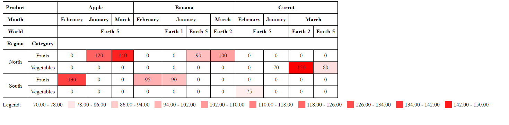

<p align="center">
    Simple reusable JavaScript pivot table for developers
</p>

<div align="center">
  <a href="https://github.com/FRanggaY/ranpivot-table">
    
  </a>
</div>

## Guide Usage

### Native HTML

Import module using CDN

```
<script src="https://cdn.jsdelivr.net/npm/ranpivot-table@1.0.6/dist/pivotTable.js"></script>
```

```html
    <div id="pivot-table-container"></div>

    <script src="https://cdn.jsdelivr.net/npm/ranpivot-table@1.0.6/dist/pivotTable.js"></script>
    <script>
        const data = [
          {"Product": "Apple",  "World": "Earth-5", "Category": "Fruits", "Region": "North", "Month": "January", "Sales": 120},
          {"Product": "Banana",  "World": "Earth-5", "Category": "Fruits", "Region": "North", "Month": "January", "Sales": 90},
          {"Product": "Banana",  "World": "Earth-1", "Category": "Fruits", "Region": "South", "Month": "January", "Sales": 90},
          {"Product": "Carrot",  "World": "Earth-5", "Category": "Vegetables", "Region": "North", "Month": "January", "Sales": 70},
          {"Product": "Apple",  "World": "Earth-5", "Category": "Fruits", "Region": "South", "Month": "February", "Sales": 130},
          {"Product": "Banana",  "World": "Earth-5", "Category": "Fruits", "Region": "South", "Month": "February", "Sales": 95},
          {"Product": "Carrot",  "World": "Earth-5", "Category": "Vegetables", "Region": "South", "Month": "February", "Sales": 75},
          {"Product": "Apple",  "World": "Earth-5", "Category": "Fruits", "Region": "North", "Month": "March", "Sales": 140},
          {"Product": "Banana",  "World": "Earth-2", "Category": "Fruits", "Region": "North", "Month": "March", "Sales": 100},
          {"Product": "Carrot",  "World": "Earth-5", "Category": "Vegetables", "Region": "North", "Month": "March", "Sales": 80}
        ];

        const table = document.getElementById("pivot-table-container");

        const rowFields = ['Region', 'Category'];
        const columnFields = ['Product', 'Month', 'World'];
        const valueField = 'Sales';
        const aggregation = 'sum';
        const heatMapOptions = {
          enableHeatmap: true,
          enableRowHeatmap: false,
          enableColHeatmap: false
        }

        const pivotTable = new RanPivotTable(data, rowFields, columnFields, valueField, aggregation, heatMapOptions);
        table.innerHTML = pivotTable.render();

    </script>
```

### Vite React

Install Module

```
npm install ranpivot-table
```

```js
import RanPivotTableComponent from 'ranpivot-table/dist/react/pivotTable'

function App() {
  const data = [
    {"Product": "Apple",  "World": "Earth-5", "Category": "Fruits", "Region": "North", "Month": "January", "Sales": 120},
    {"Product": "Banana",  "World": "Earth-5", "Category": "Fruits", "Region": "North", "Month": "January", "Sales": 90},
    {"Product": "Banana",  "World": "Earth-1", "Category": "Fruits", "Region": "South", "Month": "January", "Sales": 90},
    {"Product": "Carrot",  "World": "Earth-5", "Category": "Vegetables", "Region": "North", "Month": "January", "Sales": 70},
    {"Product": "Apple",  "World": "Earth-5", "Category": "Fruits", "Region": "South", "Month": "February", "Sales": 130},
    {"Product": "Banana",  "World": "Earth-5", "Category": "Fruits", "Region": "South", "Month": "February", "Sales": 95},
    {"Product": "Carrot",  "World": "Earth-5", "Category": "Vegetables", "Region": "South", "Month": "February", "Sales": 75},
    {"Product": "Apple",  "World": "Earth-5", "Category": "Fruits", "Region": "North", "Month": "March", "Sales": 140},
    {"Product": "Banana",  "World": "Earth-2", "Category": "Fruits", "Region": "North", "Month": "March", "Sales": 100},
    {"Product": "Carrot",  "World": "Earth-5", "Category": "Vegetables", "Region": "North", "Month": "March", "Sales": 80}
  ];

  const rowFields = ['Region', 'Category'];
  const columnFields = ['Product', 'Month', 'World'];
  const valueField = 'Sales';
  const aggregation = 'sum';

  return (
    <RanPivotTableComponent
      data={data}
      rowFields={rowFields}
      columnFields={columnFields}
      valueField={valueField}
      aggregationFunction={aggregation}
      heatmapOptions={{
        enableHeatmap: true,
        enableRowHeatmap: false,
        enableColHeatmap: false,
        showLegend: false,
      }}
    />
  )
}

export default App
```


## Documentation

* [Native HTML Examples](https://github.com/FRanggaY/ranpivot-table/tree/master/examples/)
* [Vite React Examples](https://github.com/FRanggaY/ranpivot-table-vite-react)

## Contributing

Want to contribute? Great!

For support, please post on [Github Issue](https://github.com/FRanggaY/ranpivot-table/issues).

## License

RanPivot Table is available under the [MIT license](LICENSE.md).